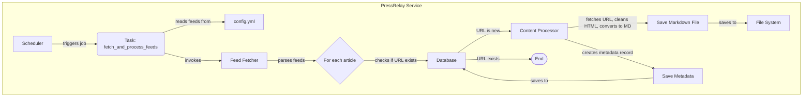

# PressRelay Architecture

This document outlines the architecture for `pressrelay`, a service that downloads news from RSS feeds, converts them to markdown documents ready for LLM consumption, and stores metadata in a database for querying.

### Core Components

1.  **Scheduler:** The heart of the service. A central process that triggers the feed download job at a regular, configurable interval (e.g., every 30 minutes).
2.  **Feed Fetcher:** Responsible for downloading content from a list of RSS feeds. It parses the feed and identifies articles that haven't been processed yet by checking against the database.
3.  **Content Processor:** Takes an article URL, fetches the full HTML, extracts the primary article content (stripping ads, navbars, etc.), converts it to a clean Markdown document, and saves it to a designated folder.
4.  **Datastore:** A dual-component system:
    *   **SQL Database:** A robust database (like SQLite for simplicity or PostgreSQL for scale) to store structured metadata for each article (e.g., title, URL, publication date, source, path to the markdown file). This makes the articles easily queryable.
    *   **File System:** A simple directory structure to store the actual Markdown content files.
5.  **Configuration:** A simple YAML or `.env` file to manage the list of RSS feeds, database connection details, and other settings.

### Workflow Diagram



### Proposed Technology Stack

*   **Language:** Python 3.9+ (managed by `uv`)
*   **Package Manager:** `uv` - For fast dependency resolution and environment management.
*   **Scheduling:** `APScheduler` - A powerful, in-process task scheduler.
*   **RSS Parsing:** `feedparser` - The de-facto standard for handling various RSS and Atom feed formats.
*   **HTML Fetching & Conversion:**
    *   `trafilatura` - A robust library to extract the main text content from a webpage's HTML, removing boilerplate.
    *   `markdownify` - To convert the cleaned HTML into Markdown.
*   **Database Management:** `SQLAlchemy` - A comprehensive ORM that provides a Python-native way to interact with the database.

### Database Schema

A single table, `articles`, would be sufficient to start:

| Column Name | Data Type | Description |
| :--- | :--- | :--- |
| `id` | Integer | Primary Key |
| `title` | String | The title of the article |
| `url` | String | The unique original URL of the article |
| `source_feed` | String | The RSS feed this article came from |
| `published_date` | DateTime | The publication date of the article |
| `processed_date` | DateTime | When the article was downloaded and processed |
| `markdown_path`| String | The local file path to the saved Markdown document |

### Proposed Directory Structure

```
/Users/ek/Projects/pressrelay/
├───data/
│   ├───markdown/           # Root folder for generated markdown files
│   └───pressrelay.db       # SQLite database file
├───pressrelay/
│   ├───__init__.py
│   ├───main.py             # Service entry point, scheduler setup
│   ├───database.py         # SQLAlchemy models and db session setup
│   ├───tasks.py            # The main job logic (fetch, process, store)
│   └───processing.py       # Content extraction and conversion logic
├───.gitignore
├───config.yml              # List of RSS feeds and other settings
├───pyproject.toml          # UV project configuration
├───uv.lock                 # UV lockfile
└───README.md
```